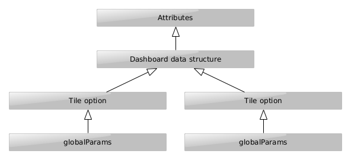
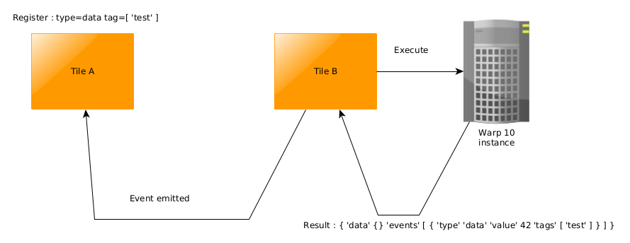

# Discovery

## Usage

### In a Web Environment

#### With NPM/Yarn

    $ npm install @senx/discovery-widgets

#### With CDN

```html

<script nomodule src="https://unpkg.com/@senx/discovery-widgets/dist/discovery/discovery.js"></script>
<script type="module" src="https://unpkg.com/@senx/discovery-widgets/dist/discovery/discovery.esm.js"></script>
```

#### Usage

```html

<html>
<head>
  <title>Test</title>
</head>
<body>
<discovery-dashboard url="https://warp.senx.io/api/v0/exec" dashboard-title="Test">
  {
  'title' 'Test'
  'description' 'Dashboard test'
  'tiles' [
  {
  'title' 'test'
  'options' { 'autoRefresh' 1 }
  'x' 0 'y' 0 'w' 12 'h' 4
  'type' 'area' 'macro' <%
  1 4 <% DROP NEWGTS 'g' STORE
  1 10 <% 'ts' STORE $g $ts RAND + STU * NOW + NaN NaN NaN RAND ADDVALUE DROP %> FOR
  $g %> FOR %>
  }
  ]
  }
</discovery-dashboard>
<script nomodule src="https://unpkg.com/@senx/discovery-widgets/dist/discovery/discovery.js"></script>
<script type="module" src="https://unpkg.com/@senx/discovery-widgets/dist/discovery/discovery.esm.js"></script>
</body>
</html>
```

### Within Warp 10

Through a WarpScript:

```
{
    'title' 'Test'
    'description' 'Dashboard test'
    'tiles' [ 
        {
            'title' 'test'
            'options' { 'autoRefresh' 1 }
            'x' 0 'y' 0 'w' 12 'h' 4
            'type' 'area' 'macro' <%
                1 4 <% DROP NEWGTS 'g' STORE
                1 10 <% 'ts' STORE $g $ts RAND + STU * NOW + NaN NaN NaN RAND ADDVALUE DROP %> FOR
                $g %> FOR %> 
        }
    ] 
}
@senx/discovery2/render
```

## Configuration

### discovery-dashboard

This is the main Web Component.

- [More Dashboard Samples](src/storybook/discovery.dashboard.stories.tsx)
- [More Scada Samples](src/storybook/discovery.scada.stories.tsx)

#### Attributes

| Property         | Attribute         |  Type                     | Default       | Description |
| ---------------- | ----------------- | ------------------------ | ------------- |-------------|
| `autoRefresh`    | `auto-refresh`    | `number`                 | `-1`          | Reloads the dashboard each x seconds, -1 to disable it |
| `cellHeight`     | `cell-height`     | `number`                 | `220`         | If type = "scada", cell height in pixels |
| `cols`           | `cols`            | `number`                 | `12`          | If type = "scada", number of columns of the grid | 
| `dashboardTitle` | `dashboard-title` | `string`                 | `undefined`   | Title of the dashboard, not mandatory, could be overridden by the dashboard definition (see Dashboard Definition below). | 
| `debug`          | `debug`           | `boolean`                | `false`       | Enable debug messages | 
| `options`        | `options`         | `Param / string`         | `new Param()` | Serialized JSON options (see Params below) | 
| `type`           | `type`            | `"dashboard" / "scada"`  | `'dashboard'` | Dashboard means a grid of `cols` columns, each tile is places in a cell with `x` and `y`. Scada means a free placement of tiles in pixels with  `x`, `y` and `z` |   
| `url`            | `url`             | `string`                 | `undefined`   | exec url of your Warp 10 endpoint |

#### Payload

Insert directly your dashboard definition as a WarpScript inside the HTML tag:

```html

<discovery-dashboard url="https://warp.senx.io/api/v0/exec" dashboard-title="Test">
  {
  'title' 'Test'
  'description' 'Dashboard test'
  'tiles' [
  {
  'title' 'test'
  'options' { 'autoRefresh' 1 }
  'x' 0 'y' 0 'w' 12 'h' 4
  'type' 'area' 'macro' <%
  1 4 <% DROP NEWGTS 'g' STORE
  1 10 <% 'ts' STORE $g $ts RAND + STU * NOW + NaN NaN NaN RAND ADDVALUE DROP %> FOR
  $g %> FOR %>
  }
  ]
  }
</discovery-dashboard>
``` 

### discovery-tile

This Web component displays a Tile based upon a WarpScript (or FLoWS). The WarpScript is executed when the tile renders.

| Property         | Attribute         |  Type                     | Default       | Description |
| ---------------- | ----------------- | ------------------------ | ------------- |-------------|
| `autoRefresh`    | `auto-refresh`    | `number`                 | `-1`          | Reloads the tile and execute again the script each x seconds, -1 to disable it |
| `chartTitle`     | `chart-title`     | `string`                 | `undefined`   | Title of the Tile, not mandatory, could be overridden by the dashboard definition (see Dashboard Definition below). | 
| `debug`          | `debug`           | `boolean`                | `false`       | Enable debug messages | 
| `options`        | `options`         | `Param / string`         | `new Param()` | Serialized JSON options (see Params below) | 
| `type`           | `type`            | `line, area, scatter, spline-area, spline, step, step-after, step-before, annotation, bar, display, image, map, gauge, linear-gauge, circle, pie, plot, doughnut, rose, tabular, svg, input:text, input:list, input:secret, input:autocomplete, input:slider, input:date, input:date-range, button`  | | Chart type |   
| `url`            | `url`             | `string`                 | `undefined`   | exec url of your Warp 10 endpoint |
| `lang`            | `lang`             | `warpscript, flows`                 | `warpscript`   | Language used  |

````html

<discovery-tile url="warp 10 url"
                unit="°C"
                type="text"
                chart-title="Text">
  { 'data' 42 'globalParams' { 'bgColor' 'darkblue' 'fontColor' 'cyan' } }
</discovery-tile>
````

### discovery-tile-result

This Web component displays a Tile based upon a WarpScript (or FLoWS) execution result (DataModel).

| Property         | Attribute         |  Type                     | Default       | Description |
| ---------------- | ----------------- | ------------------------ | ------------- |-------------|
| `chartTitle`     | `chart-title`     | `string`                 | `undefined`   | Title of the Tile, not mandatory, could be overridden by the dashboard definition (see Dashboard Definition below). | 
| `debug`          | `debug`           | `boolean`                | `false`       | Enable debug messages | 
| `options`        | `options`         | `Param / string`         | `new Param()` | Serialized JSON options (see Params below) | 
| `type`           | `type`            | `line, area, scatter, spline-area, spline, step, step-after, step-before, annotation, bar, display, image, map, gauge, linear-gauge, circle, pie, plot, doughnut, rose, tabular, svg, input:text, input:list, input:secret, input:autocomplete, input:slider, input:date, input:date-range, button`  | | Chart type |   
| `url`            | `url`             | `string`                 | `undefined`   | exec url of your Warp 10 endpoint |
| `height`     | `height`      |  `number`            | | Fixed height of the tile |
| `width`     | `width`      |   `number`          |  | Fixed width of the tile |
| `result`     | `result`      |  `DataModel / string`           |  | Execution result |

````html

<discovery-tile-result url="warp 10 url"
                       unit="°C"
                       type="text"
                       chart-title="Text">
  { 'data' 42 'globalParams' { 'bgColor' 'darkblue' 'fontColor' 'cyan' } }
</discovery-tile-result>
````

#### Params / Options

Options inherit from higher level. You can use options as an attribute in `<discovery-dashboard />`, as a field in the
dashboard definition, as a field in a tile definition and as a field in execution result.



| Name | Type | Default | Description |
|------|------|---------|-------------|
| type | `string` | | Chart type  (line, area, scatter, spline-area, spline, step, step-after, step-before, annotation, bar, display, image, map, gauge, linear-gauge, circle, pie, plot, doughnut, rose, tabular, svg, input:text, input:list, input:secret, input:autocomplete, input:slider, input:date, input:date-range, button) |
| timeMode | `string` | 'date' | date, timestamp or custom |
| timeZone | `string` | 'UTC' | Timezone |
| timeUnit | `string` | 'us' | Warp 10 time unit (us, ms, ns) |
| scheme | `string` | 'WARP10' | Color scheme (COHESIVE, COHESIVE_2, BELIZE, VIRIDIS, MAGMA, INFERNO, PLASMA, YL_OR_RD, YL_GN_BU, BU_GN, WARP10, NINETEEN_EIGHTY_FOUR, ATLANTIS, DO_ANDROIDS_DREAM, DELOREAN, CTHULHU, ECTOPLASM, T_MAX_400_FILM ) |
| showLegend | `boolean` | false | Display the chart legend |
| unit | `string` | | Unit to be displayed |
| bgColor |  `string` | | Background color of tiles |
| datasetColor | `string` | | Only for the `param` field in execution result. Color of the trace |
| fontColor |  `string` | | Font color in tiles |
| borderColor |  `string` | | Border color in tiles |
| showLegend |  `boolean` | false | Display chart legend |
| responsive |  `boolean` | true | Responsive charts |
| showRangeSelector |  `boolean` | false | Display the skyline below line or area charts |
| autoRefresh |  `number` | -1 | if positive value, will refresh with a request each `autoRefresh` second |
| showErrors |  `boolean` | true | Display errors if any |
| showStatus |  `boolean` | true | Display the Warp 10 execution status |
| expandAnnotation |  `boolean` | false | Expand annotations |
| scheme | `string` | 'WARP10' | Color scheme ( COHESIVE, COHESIVE_2, BELIZE, VIRIDIS, MAGMA, INFERNO, PLASMA, YL_OR_RD, YL_GN_BU, BU_GN, WARP10, NINETEEN_EIGHTY_FOUR, ATLANTIS, DO_ANDROIDS_DREAM, DELOREAN, CTHULHU, ECTOPLASM, T_MAX_400_FILM, MATRIX, CHARTANA) |
| eventHandler | `string` | 'type=Regexp,tag=Regexp' | Only applies on Tiles and Dashboard. See the events chapter below |

### Dashboard definition

| Name | Type | Default | Description |
|------|------|---------|-------------|
| title | `string` | | Dashboard title |
| description | `string` | | Dashboard sub-title |
| tiles | `Tile[]` | | Array of tiles |

### Tile definition

- If the dashboard type is **'dashboard'**, x, y, h and w are expressed in cells. x and y begin at 0, the top left
  corner, w and h begin at 1.
- If the dashboard type is **'scada'**, x, y, h and w are expressed in pixels. x and y begin at 0, the top left corner.
  z represents the z-index.

Data are displayed either with `data` or with `macro`. Auto-refresh for tiles only applies for `macro`.

| Name | Type | Default | Description |
|------|------|---------|-------------|
| type | `string` | | Chart type  (line, area, scatter, spline-area, spline, step, step-after, step-before, annotation, bar, display, image, map, gauge, linear-gauge, circle, pie, plot, doughnut, rose, tabular, svg, input:text, input:list, input:secret, input:autocomplete, input:slider, input:date, input:date-range, button |
| endpoint | `string` | | exec url of your Warp 10 endpoint |
| title | `string` | | Tile title |
| unit | `string` | | Unit to be displayed |
| x | `number` | | X position of the Tile. |
| y | `number` | | Y position of the Tile. |
| w | `number` | | Width the Tile. |
| h | `number` | | Height the Tile. |
| z | `number` | | Z index the Tile. |
| data | `[]` | | Array of static data computed when the dashboard is rendered. See Execution Result below. |
| macro | `<% macro %>` | | A macro executed when the tile loads in the display. See Execution Result below. |
| options | `Option` | | Options (see above) concerning this tile |

### Execution result (DataModel)

You could either return a single value ( GTS, number or string depending on the chart type), or a complex data
structure:

| Name | Type | Description |
|------|------|-------------|
| data | `GTS`, `GTS[]`, `string`, `number` |  Data to display depending on the chart type |
| globalParams |  `Option` | Global options (see above) concerning this tile |
| params | `Option[]` | List of options (see above) concerning each displayed data depending of the index of this array |
| events | `Events[]` | List of events to emit (see below) |

### Common CSS vars

| Name | Default |
|------|------|
| --gts-classname-font-color | #004eff |
| --gts-labelname-font-color | #19A979 |
| --gts-attrname-font-color | #ED4A7B |
| --gts-separator-font-color | #a0a0a0 |
| --gts-labelvalue-font-color | #000000 |
| --gts-attrvalue-font-color | #000000 |
| --warp-view-font-color | #000000 |
| --warp-view-bg-color | transparent |

### Specific charts configuration and CSS styles

| Event  | Description | Type                |
| ------ | ----------- | ------------------- |
| `draw` |             | `CustomEvent<void>` |

#### line, area, scatter, spline-area, spline, step, step-after, step-before

- [More Line Samples](src/storybook/discovery.line.stories.tsx)
- [More Area Samples](src/storybook/discovery.area.stories.tsx)
- [More Scatter Samples](src/storybook/discovery.scatters.stories.tsx)

| Name | Default |
|------|------|
| --warp-view-chart-label-color | #8e8e8e |
| --warp-view-chart-grid-color | #8e8e8e |

| Name | Type | Description |
|------|------|-------------|
| data | `GTS`, `GTS[]` |  Data to display, numeric GTS only |
| globalParams |  `Option` | Global options (see above) concerning this tile |
| params | `Option[]` | List of options (see above) concerning each displayed dataset depending of the index of this array |
| events | `Events[]` | List of events to emit (see below) |

Supported option per series are:

- datasetColor: Hex CSS color of the series. ie: '#fff00f'
- type: Chart type (line, area, scatter, spline-area, spline, step, step-after, step-before)
- xAxis: In case of multi-X axis support, represents the index of related axis.
- yAxis: In case of multi-Y axis support, represents the index of related axis.

````
1 4 <% 
  DROP NEWGTS 'g' STORE
  1 30 <% 
    'ts' STORE 
    $g $ts RAND + STU * NOW + NaN NaN NaN RAND ADDVALUE DROP 
  %> FOR
$g %> FOR STACKTOLIST 'data' STORE
{ 
  'data' $data 
  'params' [ 
    { 'datasetColor' '#dc3545' 'xAxis' 0 }
    { 'datasetColor' '#ff9900' 'xAxis' 0 }
    { 'type' 'area' 'datasetColor' '#90d743' 'xAxis' 1 }
    { 'datasetColor' 'white' 'xAxis' 0 }
  ]
}  
````

#### annotation

[More Samples](src/storybook/discovery.annotation.stories.tsx)

| Name | Default |
|------|------|
| --warp-view-chart-label-color | #8e8e8e |
| --warp-view-chart-grid-color | #8e8e8e |

| Name | Type | Description |
|------|------|-------------|
| data | `GTS`, `GTS[]` |  Data to display, non-numeric GTS only |
| globalParams |  `Option` | Global options (see above) concerning this tile |
| params | `Option[]` | List of options (see above) concerning each displayed dataset depending of the index of this array |
| events | `Events[]` | List of events to emit (see below) |

Supported option per series are:

- datasetColor: Hex CSS color of the series. ie: '#fff00f'

#### bar

[More Samples](src/storybook/discovery.bar.stories.tsx)

| Name | Default |
|------|------|
| --warp-view-chart-label-color | #8e8e8e |
| --warp-view-chart-grid-color | #8e8e8e |

| Name | Type | Description |
|------|------|-------------|
| data | `GTS`, `GTS[]`, custom data |  Data to display |
| globalParams |  `Option` | Global options (see above) concerning this tile |
| params | `Option[]` | List of options (see above) concerning each displayed dataset depending of the index of this array |
| events | `Events[]` | List of events to emit (see below) |

Supported option per series are:

- datasetColor: Hex CSS color of the series. ie: '#fff00f'
- bar
  - horizontal: Bar chart orientation
  - stacked

##### Custom data:

````json
{
  "title": "Test",
  "columns":  [ "A", "B", "C", "D" ],
  "rows": [
    [ "label X", 15, 56, 44, 22 ],
    [ "label Y", 1, 5, 4, 2 ],
    [ "label Z", 14, 45, 78, 12 ]
  ]
}
````

#### display

[More Samples](src/storybook/discovery.display.stories.tsx)

| Name | Type | Description |
|------|------|-------------|
| data | `number`, `string`, custom data |  Data to display |
| globalParams |  `Option` | Global options (see above) concerning this tile |
| params | `Option[]` | List of options (see above) concerning each displayed dataset depending of the index of this array |
| events | `Events[]` | List of events to emit (see below) |

- Option.timeMode:
  - date: convert the value into an ISO date.
  - duration: convert the value to a human-readable duration.
  - custom: display value as is, including HTML.

##### Custom Data Samples:

````
{ 'data' 42 'globalParams' { 'timeMode' 'custom' } }
````

````
{ 'data' NOW 'globalParams' { 'timeMode' 'date' } }
````

````
{ 'data' NOW 5 s - 'globalParams' { 'timeMode' 'duration' } }
````

````
{
  'data' '<a href="https://warp10.io/" target="_blank">Warp 10</a>'
  'globalParams' { 'bgColor' '#f57f17' 'fontColor' '#bc5100' 'timeMode' 'custom' }
}
````

````
{
  'data' { 'text' 'SenX.io' 'url' 'https://senx.io' }
  'globalParams' { 'bgColor' '#f57f17' 'fontColor' '#bc5100' }
}
````

#### image

[More Samples](src/storybook/discovery.image.stories.tsx)

| Name | Type | Description |
|------|------|-------------|
| data |  `string`,  `string[]`, custom data |  Base64 images to display |
| globalParams |  `Option` | Global options (see above) concerning this tile |
| params | `Option[]` | List of options (see above) concerning each displayed dataset depending of the index of this array |
| events | `Events[]` | List of events to emit (see below) |

#### map

[More Samples](src/storybook/discovery.map.stories.tsx)

| Name | Type | Description |
|------|------|-------------|
| data |   `GTS`, `GTS[]`, custom data  |  Data to display |
| globalParams |  `Option` | Global options (see above) concerning this tile |
| params | `Option[]` | List of options (see above) concerning each displayed dataset depending of the index of this array |
| events | `Events[]` | List of events to emit (see below) |

##### Custom data: 

- `string[]`: considered as GEOJson
- `GTS[]`: considered as Path

##### Options

| Name | Type | Description |
|------|------|-------------|
| tiles | `string[]` | List of custom tile layers |
| mapType | `string` | Base tile layer (NONE, DEFAULT, HOT, TOPO, TOPO2, STADIA, STADIA_DARK, TONER, TONER_LITE, TERRAIN, ESRI, SATELLITE, OCEANS, GRAY, GRAYSCALE, WATERCOLOR, CARTODB, CARTODB_DARK) |
| startLat | `number` | Initial latitude position |
| startLong | `number` | Initial longitude position |
| startZoom | `number` | Initial zoom level |
| maxNativeZoom | `number` | Maximum zoom number the tile source has available. If it is specified, the tiles on all zoom levels higher than maxNativeZoom will be loaded from maxNativeZoom level and auto-scaled. |
| maxZoom | `number` | The maximum zoom level up to which this layer will be displayed (inclusive). |

##### Params:

Render dots without lines:

````
{
  'key' 'bases'
  'render' 'dots'
  "color" "#f44336"
  "line" false
}
````
Render weighted dots:

````
{
  'key' 'sightings'
  'render' 'weightedDots'
  "color" "#31C0F6cc"
  "borderColor" "#31C0F6"
  "maxValue" 100
  "minValue" 0
}
````

#### gauge, circle

[More Samples](src/storybook/discovery.gauge.stories.tsx)

| Name | Default |
|------|------|
| --warp-view-chart-label-color | #8e8e8e |
| --warp-view-chart-grid-color | #8e8e8e |

| Name | Type | Description |
|------|------|-------------|
| data | `GTS`, `GTS[]`, custom data |  Data to display |
| globalParams |  `Option` | Global options (see above) concerning this tile |
| params | `Option[]` | List of options (see above) concerning each displayed dataset depending of the index of this array |
| events | `Events[]` | List of events to emit (see below) |

##### Params

| Name | Type | Description |
|------|------|-------------|
| maxValue | `number` | Max value for gauge |

#### linear-gauge

[More Samples](src/storybook/discovery.gauge.stories.tsx)

| Name | Default |
|------|------|
| --warp-view-chart-label-color | #8e8e8e |
| --warp-view-chart-grid-color | #8e8e8e |

| Name | Type | Description |
|------|------|-------------|
| data | `GTS`, `GTS[]`, custom data |  Data to display |
| globalParams |  `Option` | Global options (see above) concerning this tile |
| params | `Option[]` | List of options (see above) concerning each displayed dataset depending of the index of this array |
| events | `Events[]` | List of events to emit (see below) |

##### Options

| Name | Type | Description |
|------|------|-------------|
| gauge.horizontal | `boolean` | Gauge orientation |

##### Params

| Name | Type | Description |
|------|------|-------------|
| maxValue | `number` | Max value for gauge |

#### pie, doughnut, rose

- [More Pie Samples](src/storybook/discovery.pie.stories.tsx)
- [More Doughnut Samples](src/storybook/discovery.doughnut.stories.tsx)
- [More Rose Samples](src/storybook/discovery.rose.stories.tsx)

| Name | Default |
|------|------|
| --warp-view-chart-label-color | #8e8e8e |
| --warp-view-chart-grid-color | #8e8e8e |

| Name | Type | Description |
|------|------|-------------|
| data | `GTS`, `GTS[]`, custom data |  Data to display |
| globalParams |  `Option` | Global options (see above) concerning this tile |
| params | `Option[]` | List of options (see above) concerning each displayed dataset depending of the index of this array |
| events | `Events[]` | List of events to emit (see below) |

##### Custom data:

`{ 'key':string 'value':number }[]`

#### plot

[More Samples](src/storybook/discovery.plot.stories.tsx)

See line and annotation.

#### tabular

[More Samples](src/storybook/discovery.tabular.stories.tsx)

| Name | Default |
|------|------|
| --warp-view-datagrid-cell-padding | 5px |
| --warp-view-datagrid-odd-bg-color | #ffffff |
| --warp-view-datagrid-odd-color | #404040 |
| --warp-view-datagrid-even-bg-color | #c0c0c0 |
| --warp-view-datagrid-even-color | #000000 |
| --warp-view-pagination-border-color | #c0c0c0 |
| --warp-view-pagination-bg-color | #ffffff |
| --warp-view-pagination-active-bg-color | #4CAF50 |
| --warp-view-pagination-active-color | #ffffff |
| --warp-view-pagination-active-border-color | #4CAF50 |
| --warp-view-pagination-hover-bg-color | #c0c0c0 |
| --warp-view-pagination-hover-color | #000000 |
| --warp-view-pagination-hover-border-color | #c0c0c0 |
| --warp-view-pagination-disabled-color | #c0c0c0 |

| Name | Type | Description |
|------|------|-------------|
| data | `GTS`, `GTS[]`, custom data |  Data to display |
| globalParams |  `Option` | Global options (see above) concerning this tile |
| params | `Option[]` | List of options (see above) concerning each displayed dataset depending of the index of this array |
| events | `Events[]` | List of events to emit (see below) |

##### Custom data:

````
{ 
  'title':string'
  'columns':string[]
  'rows' <string|number>[]
}[]
````

Sample:
````
{ 'data' {
  'title' 'Test'
  'columns'  [ 'Name' 'A' 'B' 'C' 'Link' ]
  'rows' [
    [ 'label X' 15 56 44 '<' 'a href="https://warp10.io/">Warp 10</' + 'a>' + ]
    [ 'label Y' 1 5 4 '<' 'a href="https://senx.io/">SenX</' + 'a>' + ]
    [ 'label Z' 14 45 78 '<' 'img src="https://warp10.io/assets/img/header-w-white.png" />' + ]
  ]
  } 
}
````

#### svg

[More Samples](src/storybook/discovery.svg.stories.tsx)

| Name | Type | Description |
|------|------|-------------|
| data | `string[]` |  SVG to display |
| globalParams |  `Option` | Global options (see above) concerning this tile |
| params | `Option[]` | List of options (see above) concerning each displayed dataset depending of the index of this array |
| events | `Events[]` | List of events to emit (see below) |

#### input:text, input:secret

| Name | Default |
|------|------|
| --warp-view-input-font-size | 1rem |
| --warp-view-input-border-radius | 0.25rem |
| --warp-view-input-border-color | #c0c0c0 |
| --warp-view-input-label-color | #404040 |
| --warp-view-input-bg-color | #ffffff |
| --warp-view-button-font-size | 1rem |
| --warp-view-button-border-color | #004eff |
| --warp-view-button-padding | .375rem .75rem |
| --warp-view-button-label-color | #ffffff |
| --warp-view-button-bg-color | #004eff |
| --warp-view-button-width | auto |
| --warp-view-button-border-radius | 0.25rem |


| Name | Type | Description |
|------|------|-------------|
| data | `string`, `number` |  Initial value of the input |
| globalParams |  `Option` | Global options (see above) concerning this tile |
| params | `Option[]` | List of options (see above) concerning each displayed dataset depending of the index of this array |
| events | `Events[]` | List of events to emit (see below) |

#### input:list, input:autocomplete

[More Samples](src/storybook/discovery.input.stories.tsx)

| Name | Default |
|------|------|
| --warp-view-input-font-size | 1rem |
| --warp-view-input-border-radius | 0.25rem |
| --warp-view-input-border-color | #c0c0c0 |
| --warp-view-input-label-color | #404040 |
| --warp-view-input-bg-color | #ffffff |
| --warp-view-button-font-size | 1rem |
| --warp-view-button-border-color | #004eff |
| --warp-view-button-padding | .375rem .75rem |
| --warp-view-button-label-color | #ffffff |
| --warp-view-button-bg-color | #004eff |
| --warp-view-button-width | auto |
| --warp-view-button-border-radius | 0.25rem |


| Name | Type | Description |
|------|------|-------------|
| data | `string[]`, `number[]` |  Content of the list |
| globalParams |  `Option` | Global options (see above) concerning this tile |
| params | `Option[]` | List of options (see above) concerning each displayed dataset depending of the index of this array |
| events | `Events[]` | List of events to emit (see below) |

- `Options.input.value`: Initial value

#### input:slider

[More Samples](src/storybook/discovery.input.stories.tsx)

| Name | Default |
|------|------|
| --warp-view-input-font-size | 1rem |
| --warp-view-input-border-radius | 0.25rem |
| --warp-view-input-border-color | #c0c0c0 |
| --warp-view-input-label-color | #404040 |
| --warp-view-input-bg-color | #ffffff |
| --warp-view-button-font-size | 1rem |
| --warp-view-button-border-color | #004eff |
| --warp-view-button-padding | .375rem .75rem |
| --warp-view-button-label-color | #ffffff |
| --warp-view-button-bg-color | #004eff |
| --warp-view-button-width | auto |
| --warp-view-button-border-radius | 0.25rem |

| Name | Type | Description |
|------|------|-------------|
| data | `number` |  Initial value of the input |
| globalParams |  `Option` | Global options (see above) concerning this tile |
| params | `Option[]` | List of options (see above) concerning each displayed dataset depending of the index of this array |
| events | `Events[]` | List of events to emit (see below) |

- `Options.input.min`: Minimum value
- `Options.input.max`: Maximum value

#### input:date

[More Samples](src/storybook/discovery.input.stories.tsx)

| Name | Default |
|------|------|
| --warp-view-input-font-size | 1rem |
| --warp-view-input-border-radius | 0.25rem |
| --warp-view-input-border-color | #c0c0c0 |
| --warp-view-input-label-color | #404040 |
| --warp-view-input-bg-color | #ffffff |
| --warp-view-button-font-size | 1rem |
| --warp-view-button-border-color | #004eff |
| --warp-view-button-padding | .375rem .75rem |
| --warp-view-button-label-color | #ffffff |
| --warp-view-button-bg-color | #004eff |
| --warp-view-button-width | auto |
| --warp-view-button-border-radius | 0.25rem |

| Name | Type | Description |
|------|------|-------------|
| data | `number` |  Initial timestamp of the input in time unit |
| globalParams |  `Option` | Global options (see above) concerning this tile |
| params | `Option[]` | List of options (see above) concerning each displayed dataset depending of the index of this array |
| events | `Events[]` | List of events to emit (see below) |

#### input:date-range

TODO 

#### button

[More Samples](src/storybook/discovery.button.stories.tsx)

| Name | Default |
|------|------|
| --warp-view-button-font-size | 1rem |
| --warp-view-button-border-color | #004eff |
| --warp-view-button-padding | .375rem .75rem |
| --warp-view-button-label-color | #ffffff |
| --warp-view-button-bg-color | #004eff |
| --warp-view-button-width | auto |
| --warp-view-button-border-radius | 0.25rem |

| Name | Type | Description |
|------|------|-------------|
| data | `macro` |  Macro to exec against The Warp 10 instance when button is clicked. |
| globalParams |  `Option` | Global options (see above) concerning this tile |
| params | `Option[]` | List of options (see above) concerning each displayed dataset depending of the index of this array |
| events | `Events[]` | List of events to emit (see below) |

## Events

Tiles emit events, they also trap events. A Dashboard also traps particular events.

Events are defined in the exec result of a tile, events are emitted when parsing done.

Tiles register handlers on particular tags and event's type. You can use regular expression.

[More Samples](src/storybook/discovery.events.stories.tsx)

Sample:




````
{
    'title' 'My Dashboard With events'
    'tiles' [
      {
        'type' 'display'
        'title' 'Tile A'
        'w' 1 'h' 1 'x' 0 'y' 0
        'data' ''
        'options' { 'eventHandler' 'type=(data|style),tag=tes.*' } // Events handler
      }
      {
         'type' 'button'
         'title' 'Tile B'
         'options' { 'button' { 'label' 'Click me' } }
         'w' 1 'h' 1 'x' 1 'y' 0
         'macro' <% { 'data' <%
            RAND 100 * ROUND 'v' STORE // compute a random value
            { 
              'data' ''
              'events' [
                { 'tags' [ 'test' ] 'type' 'data' 'value' $v } } // Event emitter
               ]
             }
          %> } %>
       }
    ]
}
````

#### Event's types

##### data

| Name | Type | Description |
|------|------|-------------|
| type | `data` |  |
| tags | `string[]` | Targets  |
| value |  `GTS`, `GTS[]`, `string`, `number`, custom data | The event emitter send data to the receiver, could be any kind of data including single value, GTS list or complex data. The receiver treat this event as an execution result.  |

Sample:

````
{ 'tags' [ 'random' ] 'type' 'data' 'value' 42 } }
````

##### style

| Name | Type | Description |
|------|------|-------------|
| type | `style` |  |
| tags | `string[]` | Targets  |
| value |  `{key:sting, value:string}` | Send CSS style to be applied by the receiver with a CSS selector as key |


Sample:

````
{ 
  'tags' [ 'foo' ] 
  'type' 'style' 
  'value' {
    '.discovery-tile' 'background-color: red !important;'
    '.value' 'color: #ffffff;' 
  }
}
````

##### xpath

Only relevant for SVG targets.

| Name | Type | Description |
|------|------|-------------|
| type | `xpath` |  |
| tags | `string[]` | Targets  |
| value |  `{key:sting, value:string}`, `string` | Attributes map or XML string for node replacement |
| selector |  `string` | XPath selector starting at SVG (ie:  `/svg/g/g[2]/ellipse[3]` ) |


If `value` is a string, the node targeted by the XPath `selector` is replaced by the XML provided in `value`.

If `value` is a map, the attributes of the node targeted by the XPath `selector` will be overridden with the values 
provided in the map. The key of the map must correspond to an attribute's name.  

Sample:

````
{  // Node replacement
  'tags' [ 'svg' ] 
  'type' 'xpath'
  'value' '<' 'ellipse rx="15" ry="18" style="stroke:none;fill: red;" cx="50" cy="200"' + '/>' + 
  'selector' '/svg/g/g[2]/ellipse[1]'
}
{ // Attributes replacement
  'tags' [ 'svg' ]
  'type' 'xpath'
  'value' { 'rx' $v 'ry' $v }
  'selector' '/svg/g/g[2]/ellipse[3]'
}
````

##### popup

The only target is the Dashboard itself, you must declare handlers at the dashboard level.

Dashboard Event handler declaration:

````
{
    'title' 'My Dashboard With events'
    'options' { 'eventHandler' 'type=popup,tag=foo' }
    'tiles' [ ... ]
}
````

When event is trapped, a popup opens with a content.

| Name | Type | Description |
|------|------|-------------|
| type | `popup` |  |
| tags | `string[]` | Targets  |
| value | `Tile`,  `Dashboard` | Open a Tile or a complete dashboard in a popup. |

Sample:

````
{ 
  'tags' [ 'foo' ] 
  'type' 'popup'
  'value' { // a Tile
     'type' 'area'
     'data' [
       NEWGTS 'data' RENAME 0.0 'v' STORE
       1 500 <% 1 s * NOW SWAP - NaN NaN NaN $v RAND 0.5 - + DUP 'v' STORE ADDVALUE %> FOR
     ]
  }
}
````

##### variable

You can inject variables into `macro` defined in Tiles and modify value with an event. Butvariables must be declared at 
the Dashboard level with an initial value.

| Name | Type | Description |
|------|------|-------------|
| type | `variable` |  |
| tags | `string[]` | Targets  |
| value |  any | New value for this variable |
| selector |  `string` | Variable's name |

Complete Sample:

````
{
  'title' 'My Dashboard With events'
  'vars' {
    'myVar' 42
  }
  'tiles' [
    {
      'type' 'input:text'
      'title' 'Input emitter'
      'options' {
        'button' { 'label' 'Send' }
      }
      'w' 2 'h' 1 'x' 0 'y' 0
      'macro' <% { 'data' $myVar 'events' [ { 'tags' [ 'random' ] 'type' 'variable' 'selector' 'myVar' } ] } %>
    }
    {
      'type' 'display'
      'title' 'Event var receiver'
      'w' 2 'h' 1 'x' 0 'y' 1
      'macro' <% $myVar %>
      'options' { 'eventHandler' 'type=(variable),tag=random' }
    } 
  ]
}
````

## Demo

````shell
npm run dev
````