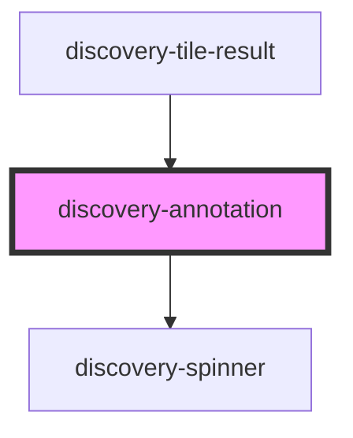

# discovery-annotation

<!-- Auto Generated Below -->

## Properties

| Property  | Attribute | Description | Type                  | Default       |
| --------- | --------- | ----------- | --------------------- | ------------- |
| `debug`   | `debug`   |             | `boolean`             | `false`       |
| `height`  | `height`  |             | `number`              | `undefined`   |
| `options` | `options` |             | `Param \| string`     | `new Param()` |
| `result`  | `result`  |             | `DataModel \| string` | `undefined`   |
| `type`    | `type`    |             | `string`              | `undefined`   |
| `unit`    | `unit`    |             | `string`              | `undefined`   |
| `width`   | `width`   |             | `number`              | `undefined`   |

## Events

| Event                | Description | Type                                                                                        |
| -------------------- | ----------- | ------------------------------------------------------------------------------------------- |
| `dataPointOver`      |             | `CustomEvent<any>`                                                                          |
| `dataPointSelected`  |             | `CustomEvent<any>`                                                                          |
| `dataZoom`           |             | `CustomEvent<{ start?: number; end?: number; min?: number; max?: number; type?: string; }>` |
| `draw`               |             | `CustomEvent<void>`                                                                         |
| `leftMarginComputed` |             | `CustomEvent<number>`                                                                       |
| `poi`                |             | `CustomEvent<any>`                                                                          |
| `timeBounds`         |             | `CustomEvent<any>`                                                                          |

## Methods

### `export(type?: "png" | "svg") => Promise<string>`

#### Parameters

| Name   | Type             | Description |
| ------ | ---------------- | ----------- |
| `type` | `"svg" \| "png"` |             |

#### Returns

Type: `Promise<string>`

### `hide(regexp: string) => Promise<void>`

#### Parameters

| Name     | Type     | Description |
| -------- | -------- | ----------- |
| `regexp` | `string` |             |

#### Returns

Type: `Promise<void>`

### `hideById(id: number | string) => Promise<void>`

#### Parameters

| Name | Type               | Description |
| ---- | ------------------ | ----------- |
| `id` | `string \| number` |             |

#### Returns

Type: `Promise<void>`

### `resize() => Promise<void>`

#### Returns

Type: `Promise<void>`

### `setFocus(regexp: string, ts: number) => Promise<void>`

#### Parameters

| Name     | Type     | Description |
| -------- | -------- | ----------- |
| `regexp` | `string` |             |
| `ts`     | `number` |             |

#### Returns

Type: `Promise<void>`

### `setZoom(dataZoom: { start?: number; end?: number; type?: string; }) => Promise<void>`

#### Parameters

| Name       | Type                                               | Description |
| ---------- | -------------------------------------------------- | ----------- |
| `dataZoom` | `{ start?: number; end?: number; type?: string; }` |             |

#### Returns

Type: `Promise<void>`

### `show(regexp: string) => Promise<void>`

#### Parameters

| Name     | Type     | Description |
| -------- | -------- | ----------- |
| `regexp` | `string` |             |

#### Returns

Type: `Promise<void>`

### `showById(id: number | string) => Promise<void>`

#### Parameters

| Name | Type               | Description |
| ---- | ------------------ | ----------- |
| `id` | `string \| number` |             |

#### Returns

Type: `Promise<void>`

### `unFocus() => Promise<void>`

#### Returns

Type: `Promise<void>`

## Dependencies

### Used by

 - [discovery-tile-result](../discovery-tile-result)

### Depends on

- [discovery-spinner](../discovery-spinner)

### Graph

----------------------------------------------

*Built with [StencilJS](https://stenciljs.com/)*
