# discovery-dashboard

<!-- Auto Generated Below -->

## Properties

| Property         | Attribute         | Description | Type                               | Default       |
| ---------------- | ----------------- | ----------- | ---------------------------------- | ------------- |
| `autoRefresh`    | `auto-refresh`    |             | `number`                           | `-1`          |
| `cellHeight`     | `cell-height`     |             | `number`                           | `220`         |
| `cols`           | `cols`            |             | `number`                           | `12`          |
| `dashboardTitle` | `dashboard-title` |             | `string`                           | `undefined`   |
| `data`           | `data`            |             | `Dashboard \| string`              | `undefined`   |
| `debug`          | `debug`           |             | `boolean`                          | `false`       |
| `inTile`         | `in-tile`         |             | `boolean`                          | `false`       |
| `options`        | `options`         |             | `Param \| string`                  | `new Param()` |
| `type`           | `type`            |             | `"dashboard" \| "flex" \| "scada"` | `'dashboard'` |
| `url`            | `url`             |             | `string`                           | `undefined`   |
| `vars`           | `vars`            |             | `any`                              | `'{}'`        |
| `warpscript`     | `warpscript`      |             | `string`                           | `undefined`   |

## Events

| Event           | Description | Type                    |
| --------------- | ----------- | ----------------------- |
| `rendered`      |             | `CustomEvent<void>`     |
| `statusError`   |             | `CustomEvent<any>`      |
| `statusHeaders` |             | `CustomEvent<string[]>` |

## Methods

### `getDashboardStructure() => Promise<Dashboard>`

#### Returns

Type: `Promise<Dashboard>`

### `getPDF(save?: boolean, output?: string) => Promise<any>`

#### Parameters

| Name     | Type      | Description |
| -------- | --------- | ----------- |
| `save`   | `boolean` |             |
| `output` | `string`  |             |

#### Returns

Type: `Promise<any>`

### `getVars() => Promise<any>`

#### Returns

Type: `Promise<any>`

## Dependencies

### Used by

 - [discovery-modal](../discovery-modal)
 - [discovery-tile-result](../discovery-tile-result)

### Depends on

- [discovery-tile](../discovery-tile)
- [discovery-tile-result](../discovery-tile-result)
- [discovery-modal](../discovery-modal)
- [discovery-spinner](../discovery-spinner)

### Graph

```mermaid
graph TD;
  discovery-dashboard --> discovery-tile
  discovery-dashboard --> discovery-tile-result
  discovery-dashboard --> discovery-modal
  discovery-dashboard --> discovery-spinner
  discovery-tile --> discovery-tile-result
  discovery-tile --> discovery-spinner
  discovery-tile-result --> discovery-dashboard
  discovery-line --> discovery-spinner
  discovery-annotation --> discovery-spinner
  discovery-bar --> discovery-spinner
  discovery-bar-polar --> discovery-spinner
  discovery-boxplot --> discovery-spinner
  discovery-display --> discovery-spinner
  discovery-display --> discovery-tile-result
  discovery-image --> discovery-spinner
  discovery-gauge --> discovery-spinner
  discovery-linear-gauge --> discovery-spinner
  discovery-pie --> discovery-spinner
  discovery-tabular --> discovery-spinner
  discovery-tabular --> discovery-pageable
  discovery-svg --> discovery-spinner
  discovery-input --> discovery-slider
  discovery-input --> discovery-input-chips
  discovery-input-chips --> discovery-input-chips-chip
  discovery-calendar --> discovery-spinner
  discovery-heatmap --> discovery-spinner
  discovery-profile --> discovery-spinner
  discovery-modal --> discovery-dashboard
  style discovery-dashboard fill:#f9f,stroke:#333,stroke-width:4px
```

----------------------------------------------

*Built with [StencilJS](https://stenciljs.com/)*
