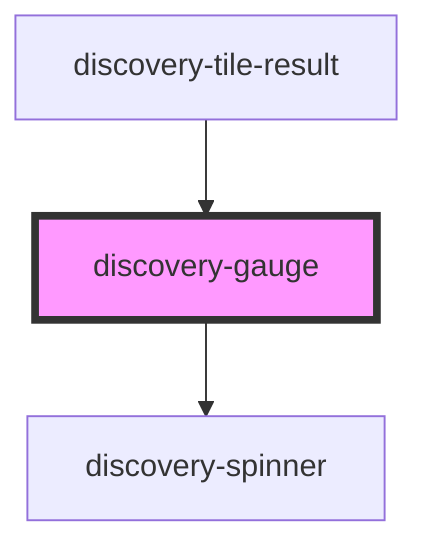

# discovery-gauge

<!-- Auto Generated Below -->

## Properties

| Property  | Attribute | Description | Type                                                                                                                                                                                                                                                                                                                                                                                                                                                                                                                                                                                                                                                                                      | Default       |
| --------- | --------- | ----------- | ----------------------------------------------------------------------------------------------------------------------------------------------------------------------------------------------------------------------------------------------------------------------------------------------------------------------------------------------------------------------------------------------------------------------------------------------------------------------------------------------------------------------------------------------------------------------------------------------------------------------------------------------------------------------------------------- | ------------- |
| `debug`   | `debug`   |             | `boolean`                                                                                                                                                                                                                                                                                                                                                                                                                                                                                                                                                                                                                                                                                 | `false`       |
| `height`  | `height`  |             | `number`                                                                                                                                                                                                                                                                                                                                                                                                                                                                                                                                                                                                                                                                                  | `undefined`   |
| `options` | `options` |             | `Param \| string`                                                                                                                                                                                                                                                                                                                                                                                                                                                                                                                                                                                                                                                                         | `new Param()` |
| `result`  | `result`  |             | `DataModel \| string`                                                                                                                                                                                                                                                                                                                                                                                                                                                                                                                                                                                                                                                                     | `undefined`   |
| `type`    | `type`    |             | `"map" \| "line" \| "area" \| "scatter" \| "step-area" \| "spline-area" \| "spline" \| "step" \| "step-after" \| "step-before" \| "annotation" \| "bar" \| "bar-polar" \| "display" \| "image" \| "gauge" \| "linear-gauge" \| "circle" \| "compass" \| "pie" \| "doughnut" \| "rose" \| "tabular" \| "svg" \| "input:text" \| "input:list" \| "input:secret" \| "input:autocomplete" \| "input:chips" \| "input:chips-autocomplete" \| "input:slider" \| "input:date" \| "input:date-range" \| "input:multi" \| "input:multi-cb" \| "button" \| "button:radio" \| "hidden" \| "calendar" \| "heatmap" \| "profile" \| "boxplot" \| "dashboard" \| "dashboard:flex" \| "dashboard:scada"` | `undefined`   |
| `unit`    | `unit`    |             | `string`                                                                                                                                                                                                                                                                                                                                                                                                                                                                                                                                                                                                                                                                                  | `undefined`   |
| `width`   | `width`   |             | `number`                                                                                                                                                                                                                                                                                                                                                                                                                                                                                                                                                                                                                                                                                  | `undefined`   |

## Events

| Event               | Description | Type                |
| ------------------- | ----------- | ------------------- |
| `dataPointOver`     |             | `CustomEvent<any>`  |
| `dataPointSelected` |             | `CustomEvent<any>`  |
| `draw`              |             | `CustomEvent<void>` |

## Methods

### `export(type?: 'png' | 'svg') => Promise<string>`

#### Parameters

| Name   | Type             | Description |
| ------ | ---------------- | ----------- |
| `type` | `"svg" \| "png"` |             |

#### Returns

Type: `Promise<string>`

### `hide(regexp: string) => Promise<void>`

#### Parameters

| Name     | Type     | Description |
| -------- | -------- | ----------- |
| `regexp` | `string` |             |

#### Returns

Type: `Promise<void>`

### `hideById(id: number | string) => Promise<void>`

#### Parameters

| Name | Type               | Description |
| ---- | ------------------ | ----------- |
| `id` | `string \| number` |             |

#### Returns

Type: `Promise<void>`

### `resize() => Promise<void>`

#### Returns

Type: `Promise<void>`

### `show(regexp: string) => Promise<void>`

#### Parameters

| Name     | Type     | Description |
| -------- | -------- | ----------- |
| `regexp` | `string` |             |

#### Returns

Type: `Promise<void>`

### `showById(id: number | string) => Promise<void>`

#### Parameters

| Name | Type               | Description |
| ---- | ------------------ | ----------- |
| `id` | `string \| number` |             |

#### Returns

Type: `Promise<void>`

## Dependencies

### Used by

 - [discovery-tile-result](../discovery-tile-result)

### Depends on

- [discovery-spinner](../discovery-spinner)

### Graph

----------------------------------------------

*Built with [StencilJS](https://stenciljs.com/)*
