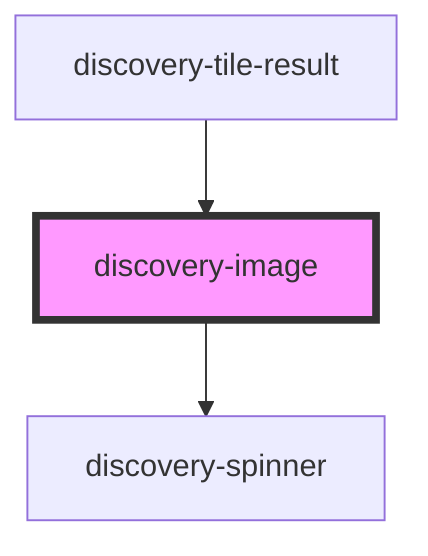

# discovery-image

<!-- Auto Generated Below -->

## Properties

| Property  | Attribute | Description | Type                  | Default       |
| --------- | --------- | ----------- | --------------------- | ------------- |
| `debug`   | `debug`   |             | `boolean`             | `false`       |
| `height`  | `height`  |             | `number`              | `undefined`   |
| `options` | `options` |             | `Param \| string`     | `new Param()` |
| `result`  | `result`  |             | `DataModel \| string` | `undefined`   |
| `type`    | `type`    |             | `string`              | `undefined`   |
| `unit`    | `unit`    |             | `string`              | `''`          |
| `width`   | `width`   |             | `number`              | `undefined`   |

## Events

| Event  | Description | Type                |
| ------ | ----------- | ------------------- |
| `draw` |             | `CustomEvent<void>` |

## Methods

### `export(type?: "png" | "svg") => Promise<string[]>`

#### Parameters

| Name   | Type             | Description |
| ------ | ---------------- | ----------- |
| `type` | `"svg" \| "png"` |             |

#### Returns

Type: `Promise<string[]>`

## Dependencies

### Used by

 - [discovery-tile-result](../discovery-tile-result)

### Depends on

- [discovery-spinner](../discovery-spinner)

### Graph

----------------------------------------------

*Built with [StencilJS](https://stenciljs.com/)*
