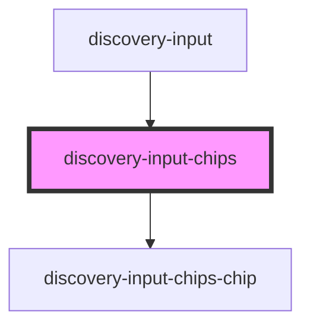

# discovery-input-chips

<!-- Auto Generated Below -->

## Properties

| Property          | Attribute         | Description | Type                                  | Default     |
| ----------------- | ----------------- | ----------- | ------------------------------------- | ----------- |
| `autocomplete`    | --                |             | `(value: string) => Promise<any>`     | `undefined` |
| `chips`           | --                |             | `string[]`                            | `[]`        |
| `constrain_input` | `constrain_input` |             | `boolean`                             | `false`     |
| `containsFn`      | --                |             | `(value: string) => Promise<boolean>` | `undefined` |
| `disabled`        | `disabled`        |             | `boolean`                             | `false`     |
| `value`           | `value`           |             | `string`                              | `undefined` |

## Events

| Event        | Description | Type                    |
| ------------ | ----------- | ----------------------- |
| `chipChange` |             | `CustomEvent<string[]>` |
| `chipClick`  |             | `CustomEvent<any>`      |
| `chipCreate` |             | `CustomEvent<any>`      |
| `chipInput`  |             | `CustomEvent<void>`     |

## Dependencies

### Used by

 - [discovery-input](..)

### Depends on

- [discovery-input-chips-chip](discovery-input-chips-chip)

### Graph

----------------------------------------------

*Built with [StencilJS](https://stenciljs.com/)*
