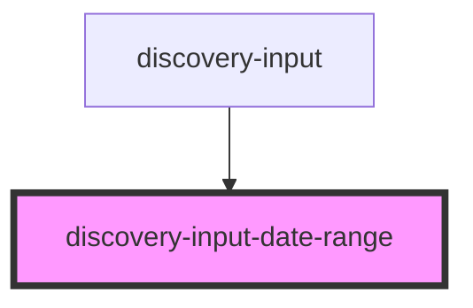

# discovery-input-date-range

<!-- Auto Generated Below -->

## Properties

| Property    | Attribute  | Description | Type       | Default       |
| ----------- | ---------- | ----------- | ---------- | ------------- |
| `dateRange` | --         |             | `number[]` | `[]`          |
| `disabled`  | `disabled` |             | `boolean`  | `undefined`   |
| `options`   | --         |             | `Param`    | `new Param()` |
| `required`  | `required` |             | `boolean`  | `undefined`   |

## Events

| Event          | Description | Type                              |
| -------------- | ----------- | --------------------------------- |
| `valueChanged` |             | `CustomEvent<number \| number[]>` |

## Dependencies

### Used by

 - [discovery-input](..)

### Graph

----------------------------------------------

*Built with [StencilJS](https://stenciljs.com/)*
