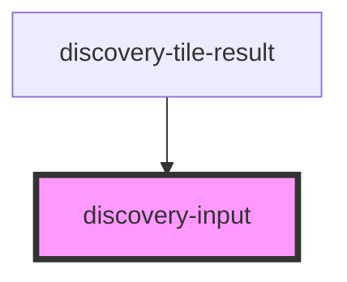

# discovery-input

<!-- Auto Generated Below -->

## Properties

| Property  | Attribute | Description | Type                                                                                                                                                                                                                                                                                                                                                                                                | Default       |
| --------- | --------- | ----------- | --------------------------------------------------------------------------------------------------------------------------------------------------------------------------------------------------------------------------------------------------------------------------------------------------------------------------------------------------------------------------------------------------- | ------------- |
| `debug`   | `debug`   |             | `boolean`                                                                                                                                                                                                                                                                                                                                                                                           | `false`       |
| `height`  | `height`  |             | `number`                                                                                                                                                                                                                                                                                                                                                                                            | `undefined`   |
| `options` | `options` |             | `Param \| string`                                                                                                                                                                                                                                                                                                                                                                                   | `new Param()` |
| `result`  | `result`  |             | `DataModel \| string`                                                                                                                                                                                                                                                                                                                                                                               | `undefined`   |
| `type`    | `type`    |             | `"line" \| "area" \| "scatter" \| "spline-area" \| "spline" \| "step" \| "step-after" \| "step-before" \| "annotation" \| "bar" \| "display" \| "image" \| "map" \| "gauge" \| "linear-gauge" \| "circle" \| "pie" \| "plot" \| "doughnut" \| "rose" \| "tabular" \| "svg" \| "input:text" \| "input:list" \| "input:secret" \| "input:autocomplete" \| "input:slider" \| "input:date" \| "button"` | `undefined`   |
| `url`     | `url`     |             | `string`                                                                                                                                                                                                                                                                                                                                                                                            | `undefined`   |
| `width`   | `width`   |             | `number`                                                                                                                                                                                                                                                                                                                                                                                            | `undefined`   |

## Events

| Event            | Description | Type                          |
| ---------------- | ----------- | ----------------------------- |
| `discoveryEvent` |             | `CustomEvent<DiscoveryEvent>` |
| `draw`           |             | `CustomEvent<void>`           |
| `execResult`     |             | `CustomEvent<any[]>`          |
| `statusError`    |             | `CustomEvent<any>`            |

## Dependencies

### Used by

 - [discovery-tile-result](../discovery-tile-result)

### Graph

----------------------------------------------

*Built with [StencilJS](https://stenciljs.com/)*
