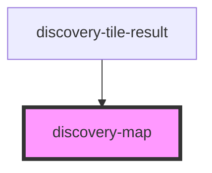

# discovery-map

<!-- Auto Generated Below -->

## Properties

| Property  | Attribute | Description | Type                                                                                                                                                                                                                                                                                                                                                                                                                                                                                          | Default       |
| --------- | --------- | ----------- | --------------------------------------------------------------------------------------------------------------------------------------------------------------------------------------------------------------------------------------------------------------------------------------------------------------------------------------------------------------------------------------------------------------------------------------------------------------------------------------------- | ------------- |
| `debug`   | `debug`   |             | `boolean`                                                                                                                                                                                                                                                                                                                                                                                                                                                                                     | `false`       |
| `height`  | `height`  |             | `number`                                                                                                                                                                                                                                                                                                                                                                                                                                                                                      | `undefined`   |
| `options` | `options` |             | `Param \| string`                                                                                                                                                                                                                                                                                                                                                                                                                                                                             | `new Param()` |
| `result`  | `result`  |             | `DataModel \| string`                                                                                                                                                                                                                                                                                                                                                                                                                                                                         | `undefined`   |
| `type`    | `type`    |             | `"line" \| "area" \| "scatter" \| "step-area" \| "spline-area" \| "spline" \| "step" \| "step-after" \| "step-before" \| "annotation" \| "bar" \| "display" \| "image" \| "map" \| "gauge" \| "linear-gauge" \| "circle" \| "compass" \| "pie" \| "plot" \| "doughnut" \| "rose" \| "tabular" \| "svg" \| "input:text" \| "input:list" \| "input:secret" \| "input:autocomplete" \| "input:slider" \| "input:date" \| "input:date-range" \| "button" \| "hidden" \| "calendar" \| "marauder"` | `undefined`   |
| `width`   | `width`   |             | `number`                                                                                                                                                                                                                                                                                                                                                                                                                                                                                      | `undefined`   |

## Events

| Event           | Description | Type                |
| --------------- | ----------- | ------------------- |
| `dataPointOver` |             | `CustomEvent<any>`  |
| `draw`          |             | `CustomEvent<void>` |

## Methods

### `export(type?: 'png' | 'svg') => Promise<any>`

#### Returns

Type: `Promise<any>`

### `hide(regexp: string) => Promise<void>`

#### Returns

Type: `Promise<void>`

### `resize() => Promise<void>`

#### Returns

Type: `Promise<void>`

### `setFocus(regexp: string, ts: number) => Promise<void>`

#### Returns

Type: `Promise<void>`

### `show(regexp: string) => Promise<void>`

#### Returns

Type: `Promise<void>`

### `unFocus() => Promise<void>`

#### Returns

Type: `Promise<void>`

## Dependencies

### Used by

 - [discovery-tile-result](../discovery-tile-result)

### Graph

----------------------------------------------

*Built with [StencilJS](https://stenciljs.com/)*
