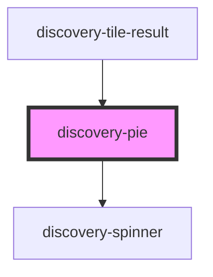

# discovery-pie

<!-- Auto Generated Below -->

## Properties

| Property   | Attribute  | Description | Type                      | Default        |
| ---------- | ---------- | ----------- | ------------------------- | -------------- |
| `debug`    | `debug`    |             | `boolean`                 | `false`        |
| `height`   | `height`   |             | `number`                  | `undefined`    |
| `language` | `language` |             | `"flows" \| "warpscript"` | `'warpscript'` |
| `options`  | `options`  |             | `Param \| string`         | `new Param()`  |
| `result`   | `result`   |             | `DataModel \| string`     | `undefined`    |
| `type`     | `type`     |             | `string`                  | `undefined`    |
| `unit`     | `unit`     |             | `string`                  | `undefined`    |
| `url`      | `url`      |             | `string`                  | `undefined`    |
| `vars`     | `vars`     |             | `string`                  | `'{}'`         |
| `width`    | `width`    |             | `number`                  | `undefined`    |

## Events

| Event               | Description | Type                          |
| ------------------- | ----------- | ----------------------------- |
| `dataPointOver`     |             | `CustomEvent<any>`            |
| `dataPointSelected` |             | `CustomEvent<any>`            |
| `discoveryEvent`    |             | `CustomEvent<DiscoveryEvent>` |
| `draw`              |             | `CustomEvent<void>`           |
| `execError`         |             | `CustomEvent<any>`            |

## Methods

### `export(type?: "png" | "svg") => Promise<string>`

#### Parameters

| Name   | Type             | Description |
| ------ | ---------------- | ----------- |
| `type` | `"png" \| "svg"` |             |

#### Returns

Type: `Promise<string>`

### `hide(regexp: string) => Promise<void>`

#### Parameters

| Name     | Type     | Description |
| -------- | -------- | ----------- |
| `regexp` | `string` |             |

#### Returns

Type: `Promise<void>`

### `hideById(id: number | string) => Promise<void>`

#### Parameters

| Name | Type               | Description |
| ---- | ------------------ | ----------- |
| `id` | `string \| number` |             |

#### Returns

Type: `Promise<void>`

### `resize() => Promise<void>`

#### Returns

Type: `Promise<void>`

### `show(regexp: string) => Promise<void>`

#### Parameters

| Name     | Type     | Description |
| -------- | -------- | ----------- |
| `regexp` | `string` |             |

#### Returns

Type: `Promise<void>`

### `showById(id: number | string) => Promise<void>`

#### Parameters

| Name | Type               | Description |
| ---- | ------------------ | ----------- |
| `id` | `string \| number` |             |

#### Returns

Type: `Promise<void>`

## Dependencies

### Used by

 - [discovery-tile-result](../discovery-tile-result)

### Depends on

- [discovery-spinner](../discovery-spinner)

### Graph

----------------------------------------------

*Built with [StencilJS](https://stenciljs.com/)*
