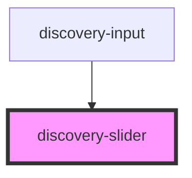

# discovery-slider

<!-- Auto Generated Below -->

## Properties

| Property   | Attribute  | Description | Type              | Default                                |
| ---------- | ---------- | ----------- | ----------------- | -------------------------------------- |
| `debug`    | `debug`    |             | `boolean`         | `undefined`                            |
| `disabled` | `disabled` |             | `boolean`         | `false`                                |
| `options`  | `options`  |             | `Param \| string` | `{ ...new Param(), timeMode: 'date' }` |
| `progress` | `progress` |             | `boolean`         | `undefined`                            |

## Events

| Event          | Description | Type                  |
| -------------- | ----------- | --------------------- |
| `startDrag`    |             | `CustomEvent<void>`   |
| `valueChanged` |             | `CustomEvent<number>` |

## Methods

### `export(_type: "png" | "svg", bgColor: string) => Promise<string>`

#### Parameters

| Name      | Type             | Description |
| --------- | ---------------- | ----------- |
| `_type`   | `"svg" \| "png"` |             |
| `bgColor` | `string`         |             |

#### Returns

Type: `Promise<string>`

### `setValue(value: number | number[]) => Promise<void>`

#### Parameters

| Name    | Type                 | Description |
| ------- | -------------------- | ----------- |
| `value` | `number \| number[]` |             |

#### Returns

Type: `Promise<void>`

## Dependencies

### Used by

 - [discovery-input](../discovery-input)

### Graph

----------------------------------------------

*Built with [StencilJS](https://stenciljs.com/)*
