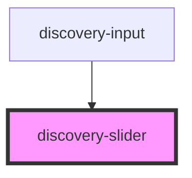

# discovery-slider

<!-- Auto Generated Below -->

## Properties

| Property   | Attribute  | Description | Type              | Default                              |
| ---------- | ---------- | ----------- | ----------------- | ------------------------------------ |
| `debug`    | `debug`    |             | `boolean`         | `undefined`                          |
| `options`  | `options`  |             | `Param \| string` | `{...new Param(), timeMode: 'date'}` |
| `progress` | `progress` |             | `boolean`         | `undefined`                          |

## Events

| Event          | Description | Type                  |
| -------------- | ----------- | --------------------- |
| `startDrag`    |             | `CustomEvent<void>`   |
| `valueChanged` |             | `CustomEvent<number>` |

## Methods

### `export(type: 'png' | 'svg', bgColor: string) => Promise<any>`

#### Returns

Type: `Promise<any>`

### `setValue(value: number) => Promise<void>`

#### Returns

Type: `Promise<void>`

## Dependencies

### Used by

 - [discovery-input](../discovery-input)

### Graph

----------------------------------------------

*Built with [StencilJS](https://stenciljs.com/)*
