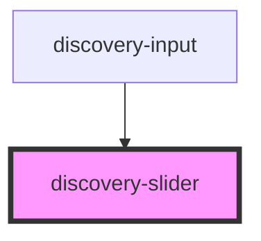

# discovery-slider

<!-- Auto Generated Below -->

## Properties

| Property  | Attribute | Description | Type              | Default                              |
| --------- | --------- | ----------- | ----------------- | ------------------------------------ |
| `debug`   | `debug`   |             | `boolean`         | `undefined`                          |
| `options` | `options` |             | `Param \| string` | `{...new Param(), timeMode: 'date'}` |

## Events

| Event          | Description | Type                  |
| -------------- | ----------- | --------------------- |
| `valueChanged` |             | `CustomEvent<number>` |

## Methods

### `setValue(value: number) => Promise<void>`

#### Returns

Type: `Promise<void>`

## Dependencies

### Used by

 - [discovery-input](../discovery-input)

### Graph

----------------------------------------------

*Built with [StencilJS](https://stenciljs.com/)*
