# discovery-spinner

<!-- Auto Generated Below -->

## Properties

| Property  | Attribute | Description | Type     | Default        |
| --------- | --------- | ----------- | -------- | -------------- |
| `message` | `message` |             | `string` | `'Loading...'` |

## Dependencies

### Used by

 - [discovery-annotation](../discovery-annotation)
 - [discovery-bar](../discovery-bar)
 - [discovery-calendar](../discovery-calendar)
 - [discovery-dashboard](../discovery-dashboard)
 - [discovery-display](../discovery-display)
 - [discovery-gauge](../discovery-gauge)
 - [discovery-image](../discovery-image)
 - [discovery-line](../discovery-line)
 - [discovery-linear-gauge](../discovery-linear-gauge)
 - [discovery-pie](../discovery-pie)
 - [discovery-svg](../discovery-svg)
 - [discovery-tabular](../discovery-tabular)
 - [discovery-tile](../discovery-tile)

### Graph

```mermaid
graph TD;
  discovery-annotation --> discovery-spinner
  discovery-bar --> discovery-spinner
  discovery-calendar --> discovery-spinner
  discovery-dashboard --> discovery-spinner
  discovery-display --> discovery-spinner
  discovery-gauge --> discovery-spinner
  discovery-image --> discovery-spinner
  discovery-line --> discovery-spinner
  discovery-linear-gauge --> discovery-spinner
  discovery-pie --> discovery-spinner
  discovery-svg --> discovery-spinner
  discovery-tabular --> discovery-spinner
  discovery-tile --> discovery-spinner
  style discovery-spinner fill:#f9f,stroke:#333,stroke-width:4px
```

----------------------------------------------

*Built with [StencilJS](https://stenciljs.com/)*
