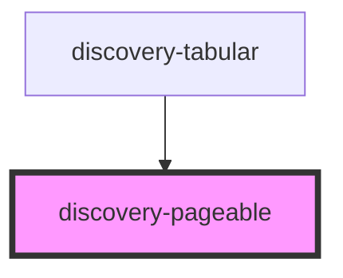

# discovery-pageable

<!-- Auto Generated Below -->

## Properties

| Property     | Attribute     | Description | Type                                                  | Default       |
| ------------ | ------------- | ----------- | ----------------------------------------------------- | ------------- |
| `data`       | --            |             | `{ name: string; values: any[]; headers: string[]; }` | `undefined`   |
| `debug`      | `debug`       |             | `boolean`                                             | `false`       |
| `elemsCount` | `elems-count` |             | `number`                                              | `15`          |
| `options`    | --            |             | `Param`                                               | `new Param()` |
| `windowed`   | `windowed`    |             | `number`                                              | `5`           |

## Dependencies

### Used by

 - [discovery-tabular](..)

### Graph

----------------------------------------------

*Built with [StencilJS](https://stenciljs.com/)*
