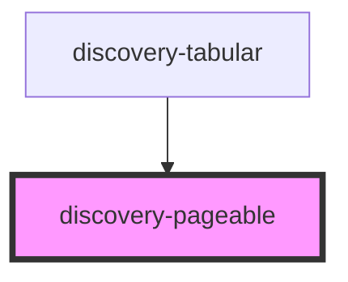

# discovery-pageable

<!-- Auto Generated Below -->

## Properties

| Property     | Attribute     | Description | Type      | Default                                       |
| ------------ | ------------- | ----------- | --------- | --------------------------------------------- |
| `data`       | --            |             | `Dataset` | `undefined`                                   |
| `debug`      | `debug`       |             | `boolean` | `false`                                       |
| `divider`    | `divider`     |             | `number`  | `undefined`                                   |
| `elemsCount` | `elems-count` |             | `number`  | `15`                                          |
| `options`    | --            |             | `Param`   | `{...new Param(), tabular: {stripped: true}}` |
| `params`     | --            |             | `Param[]` | `[]`                                          |
| `windowed`   | `windowed`    |             | `number`  | `5`                                           |

## Events

| Event               | Description | Type               |
| ------------------- | ----------- | ------------------ |
| `dataPointOver`     |             | `CustomEvent<any>` |
| `dataPointSelected` |             | `CustomEvent<any>` |

## Methods

### `getData() => Promise<{ data: any[]; headers: string[]; }>`

#### Returns

Type: `Promise<{ data: any[]; headers: string[]; }>`

## Dependencies

### Used by

 - [discovery-tabular](..)

### Graph

----------------------------------------------

*Built with [StencilJS](https://stenciljs.com/)*
