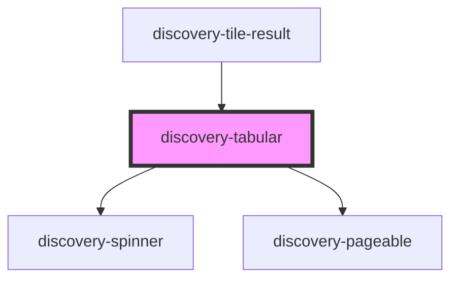

# discovery-tabular

<!-- Auto Generated Below -->

## Properties

| Property  | Attribute | Description | Type                                                                                                                                                                                                                                                                                                                                                                                                                                     | Default                              |
| --------- | --------- | ----------- | ---------------------------------------------------------------------------------------------------------------------------------------------------------------------------------------------------------------------------------------------------------------------------------------------------------------------------------------------------------------------------------------------------------------------------------------- | ------------------------------------ |
| `debug`   | `debug`   |             | `boolean`                                                                                                                                                                                                                                                                                                                                                                                                                                | `false`                              |
| `height`  | `height`  |             | `number`                                                                                                                                                                                                                                                                                                                                                                                                                                 | `undefined`                          |
| `options` | `options` |             | `Param \| string`                                                                                                                                                                                                                                                                                                                                                                                                                        | `{...new Param(), timeMode: 'date'}` |
| `result`  | `result`  |             | `DataModel \| string`                                                                                                                                                                                                                                                                                                                                                                                                                    | `undefined`                          |
| `type`    | `type`    |             | `"line" \| "area" \| "scatter" \| "step-area" \| "spline-area" \| "spline" \| "step" \| "step-after" \| "step-before" \| "annotation" \| "bar" \| "display" \| "image" \| "map" \| "gauge" \| "linear-gauge" \| "circle" \| "pie" \| "plot" \| "doughnut" \| "rose" \| "tabular" \| "svg" \| "input:text" \| "input:list" \| "input:secret" \| "input:autocomplete" \| "input:slider" \| "input:date" \| "input:date-range" \| "button"` | `undefined`                          |
| `unit`    | `unit`    |             | `string`                                                                                                                                                                                                                                                                                                                                                                                                                                 | `undefined`                          |
| `width`   | `width`   |             | `number`                                                                                                                                                                                                                                                                                                                                                                                                                                 | `undefined`                          |

## Events

| Event  | Description | Type                |
| ------ | ----------- | ------------------- |
| `draw` |             | `CustomEvent<void>` |

## Methods

### `resize() => Promise<void>`

#### Returns

Type: `Promise<void>`

## Dependencies

### Used by

 - [discovery-tile-result](../discovery-tile-result)

### Depends on

- [discovery-spinner](../discovery-spinner)
- [discovery-pageable](discovery-pageable)

### Graph

----------------------------------------------

*Built with [StencilJS](https://stenciljs.com/)*
