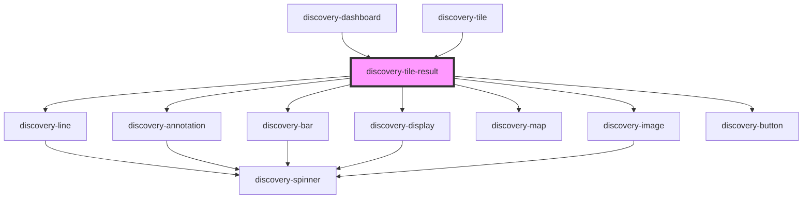

# discovery-tile-result

<!-- Auto Generated Below -->

## Properties

| Property     | Attribute     | Description | Type                                                                                                                                                                          | Default       |
| ------------ | ------------- | ----------- | ----------------------------------------------------------------------------------------------------------------------------------------------------------------------------- | ------------- |
| `chartTitle` | `chart-title` |             | `string`                                                                                                                                                                      | `undefined`   |
| `debug`      | `debug`       |             | `boolean`                                                                                                                                                                     | `false`       |
| `height`     | `height`      |             | `number`                                                                                                                                                                      | `undefined`   |
| `options`    | `options`     |             | `Param \| string`                                                                                                                                                             | `new Param()` |
| `result`     | `result`      |             | `DataModel \| string`                                                                                                                                                         | `undefined`   |
| `start`      | `start`       |             | `number`                                                                                                                                                                      | `undefined`   |
| `type`       | `type`        |             | `"annotation" \| "area" \| "bar" \| "button" \| "display" \| "image" \| "line" \| "map" \| "scatter" \| "spline" \| "spline-area" \| "step" \| "step-after" \| "step-before"` | `undefined`   |
| `unit`       | `unit`        |             | `string`                                                                                                                                                                      | `''`          |
| `url`        | `url`         |             | `string`                                                                                                                                                                      | `undefined`   |
| `width`      | `width`       |             | `number`                                                                                                                                                                      | `undefined`   |

## Dependencies

### Used by

 - [discovery-dashboard](../discovery-dashboard)
 - [discovery-tile](../discovery-tile)

### Depends on

- [discovery-line](../discovery-line)
- [discovery-annotation](../discovery-annotation)
- [discovery-bar](../discovery-bar)
- [discovery-display](../discovery-display)
- [discovery-map](../discovery-map)
- [discovery-image](../discovery-image)
- [discovery-button](../discovery-button)

### Graph

----------------------------------------------

*Built with [StencilJS](https://stenciljs.com/)*
