# discovery-tile-result

<!-- Auto Generated Below -->

## Properties

| Property           | Attribute           | Description | Type                      | Default        |
| ------------------ | ------------------- | ----------- | ------------------------- | -------------- |
| `chartDescription` | `chart-description` |             | `string`                  | `undefined`    |
| `chartTitle`       | `chart-title`       |             | `string`                  | `undefined`    |
| `debug`            | `debug`             |             | `boolean`                 | `false`        |
| `height`           | `height`            |             | `number`                  | `undefined`    |
| `language`         | `language`          |             | `"flows" \| "warpscript"` | `'warpscript'` |
| `options`          | `options`           |             | `Param \| string`         | `new Param()`  |
| `result`           | `result`            |             | `DataModel \| string`     | `undefined`    |
| `start`            | `start`             |             | `number`                  | `undefined`    |
| `type`             | `type`              |             | `string`                  | `undefined`    |
| `unit`             | `unit`              |             | `string`                  | `''`           |
| `url`              | `url`               |             | `string`                  | `undefined`    |
| `vars`             | `vars`              |             | `string`                  | `'{}'`         |
| `width`            | `width`             |             | `number`                  | `undefined`    |

## Events

| Event            | Description | Type                          |
| ---------------- | ----------- | ----------------------------- |
| `discoveryEvent` |             | `CustomEvent<DiscoveryEvent>` |
| `draw`           |             | `CustomEvent<void>`           |
| `selfType`       |             | `CustomEvent<string>`         |

## Methods

### `export(type?: "png" | "svg") => Promise<{ dataUrl: string; bgColor: string; }>`

#### Parameters

| Name   | Type             | Description |
| ------ | ---------------- | ----------- |
| `type` | `"png" \| "svg"` |             |

#### Returns

Type: `Promise<{ dataUrl: string; bgColor: string; }>`

### `hide(regexp: string) => Promise<void>`

#### Parameters

| Name     | Type     | Description |
| -------- | -------- | ----------- |
| `regexp` | `string` |             |

#### Returns

Type: `Promise<void>`

### `hideById(id: number) => Promise<void>`

#### Parameters

| Name | Type     | Description |
| ---- | -------- | ----------- |
| `id` | `number` |             |

#### Returns

Type: `Promise<void>`

### `parseEvents() => Promise<void>`

#### Returns

Type: `Promise<void>`

### `resize() => Promise<void>`

#### Returns

Type: `Promise<void>`

### `setFocus(regexp: string, ts: number, value?: number) => Promise<void>`

#### Parameters

| Name     | Type     | Description |
| -------- | -------- | ----------- |
| `regexp` | `string` |             |
| `ts`     | `number` |             |
| `value`  | `number` |             |

#### Returns

Type: `Promise<void>`

### `setZoom(dataZoom: { start?: number; end?: number; type?: string; }) => Promise<void>`

#### Parameters

| Name       | Type                                               | Description |
| ---------- | -------------------------------------------------- | ----------- |
| `dataZoom` | `{ start?: number; end?: number; type?: string; }` |             |

#### Returns

Type: `Promise<void>`

### `show(regexp: string) => Promise<void>`

#### Parameters

| Name     | Type     | Description |
| -------- | -------- | ----------- |
| `regexp` | `string` |             |

#### Returns

Type: `Promise<void>`

### `showById(id: number) => Promise<void>`

#### Parameters

| Name | Type     | Description |
| ---- | -------- | ----------- |
| `id` | `number` |             |

#### Returns

Type: `Promise<void>`

### `unFocus() => Promise<void>`

#### Returns

Type: `Promise<void>`

## Dependencies

### Used by

 - [discovery-dashboard](../discovery-dashboard)
 - [discovery-display](../discovery-display)
 - [discovery-modal](../discovery-modal)
 - [discovery-tile](../discovery-tile)

### Depends on

- [discovery-line](../discovery-line)
- [discovery-annotation](../discovery-annotation)
- [discovery-bar](../discovery-bar)
- [discovery-bar-polar](../discovery-bar-polar)
- [discovery-boxplot](../discovery-boxplot)
- [discovery-display](../discovery-display)
- [discovery-map](../discovery-map)
- [discovery-image](../discovery-image)
- [discovery-button](../discovery-button)
- [discovery-gauge](../discovery-gauge)
- [discovery-linear-gauge](../discovery-linear-gauge)
- [discovery-pie](../discovery-pie)
- [discovery-tabular](../discovery-tabular)
- [discovery-svg](../discovery-svg)
- [discovery-input](../discovery-input)
- [discovery-hidden](../discovery-hidden)
- [discovery-calendar](../discovery-calendar)
- [discovery-heatmap](../discovery-heatmap)
- [discovery-profile](../discovery-profile)
- [discovery-dashboard](../discovery-dashboard)

### Graph

```mermaid
graph TD;
  discovery-tile-result --> discovery-line
  discovery-tile-result --> discovery-annotation
  discovery-tile-result --> discovery-bar
  discovery-tile-result --> discovery-bar-polar
  discovery-tile-result --> discovery-boxplot
  discovery-tile-result --> discovery-display
  discovery-tile-result --> discovery-map
  discovery-tile-result --> discovery-image
  discovery-tile-result --> discovery-button
  discovery-tile-result --> discovery-gauge
  discovery-tile-result --> discovery-linear-gauge
  discovery-tile-result --> discovery-pie
  discovery-tile-result --> discovery-tabular
  discovery-tile-result --> discovery-svg
  discovery-tile-result --> discovery-input
  discovery-tile-result --> discovery-hidden
  discovery-tile-result --> discovery-calendar
  discovery-tile-result --> discovery-heatmap
  discovery-tile-result --> discovery-profile
  discovery-tile-result --> discovery-dashboard
  discovery-line --> discovery-spinner
  discovery-annotation --> discovery-spinner
  discovery-bar --> discovery-spinner
  discovery-bar-polar --> discovery-spinner
  discovery-boxplot --> discovery-spinner
  discovery-display --> discovery-tile-result
  discovery-image --> discovery-spinner
  discovery-gauge --> discovery-spinner
  discovery-linear-gauge --> discovery-spinner
  discovery-pie --> discovery-spinner
  discovery-tabular --> discovery-spinner
  discovery-tabular --> discovery-pageable
  discovery-svg --> discovery-spinner
  discovery-input --> discovery-slider
  discovery-input --> discovery-input-chips
  discovery-input-chips --> discovery-input-chips-chip
  discovery-calendar --> discovery-spinner
  discovery-heatmap --> discovery-spinner
  discovery-profile --> discovery-spinner
  discovery-dashboard --> discovery-tile-result
  discovery-tile --> discovery-tile-result
  discovery-modal --> discovery-tile-result
  style discovery-tile-result fill:#f9f,stroke:#333,stroke-width:4px
```

----------------------------------------------

*Built with [StencilJS](https://stenciljs.com/)*
