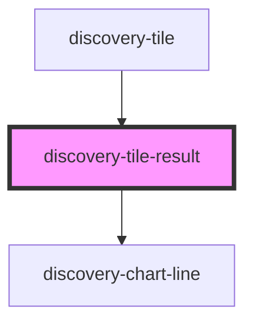

# discovery-tile-result

<!-- Auto Generated Below -->

## Properties

| Property  | Attribute | Description | Type                                                                      | Default       |
| --------- | --------- | ----------- | ------------------------------------------------------------------------- | ------------- |
| `debug`   | `debug`   |             | `boolean`                                                                 | `false`       |
| `height`  | `height`  |             | `number`                                                                  | `undefined`   |
| `options` | --        |             | `Param`                                                                   | `new Param()` |
| `result`  | `result`  |             | `string`                                                                  | `undefined`   |
| `start`   | `start`   |             | `number`                                                                  | `undefined`   |
| `type`    | `type`    |             | `"area" \| "line" \| "spline" \| "step" \| "step-after" \| "step-before"` | `undefined`   |
| `width`   | `width`   |             | `number`                                                                  | `undefined`   |

## Dependencies

### Used by

 - [discovery-tile](../discovery-tile)

### Depends on

- [discovery-chart-line](../discovery-chart-line)

### Graph

----------------------------------------------

*Built with [StencilJS](https://stenciljs.com/)*
