# discovery-tile-result

<!-- Auto Generated Below -->

## Properties

| Property     | Attribute     | Description | Type                                                                                                                                                                                                                                                                                                                                                                                                                                                                                                                                                             | Default        |
| ------------ | ------------- | ----------- | ---------------------------------------------------------------------------------------------------------------------------------------------------------------------------------------------------------------------------------------------------------------------------------------------------------------------------------------------------------------------------------------------------------------------------------------------------------------------------------------------------------------------------------------------------------------- | -------------- |
| `chartTitle` | `chart-title` |             | `string`                                                                                                                                                                                                                                                                                                                                                                                                                                                                                                                                                         | `undefined`    |
| `debug`      | `debug`       |             | `boolean`                                                                                                                                                                                                                                                                                                                                                                                                                                                                                                                                                        | `false`        |
| `height`     | `height`      |             | `number`                                                                                                                                                                                                                                                                                                                                                                                                                                                                                                                                                         | `undefined`    |
| `language`   | `language`    |             | `"flows" \| "warpscript"`                                                                                                                                                                                                                                                                                                                                                                                                                                                                                                                                        | `'warpscript'` |
| `options`    | `options`     |             | `Param \| string`                                                                                                                                                                                                                                                                                                                                                                                                                                                                                                                                                | `new Param()`  |
| `result`     | `result`      |             | `DataModel \| string`                                                                                                                                                                                                                                                                                                                                                                                                                                                                                                                                            | `undefined`    |
| `start`      | `start`       |             | `number`                                                                                                                                                                                                                                                                                                                                                                                                                                                                                                                                                         | `undefined`    |
| `type`       | `type`        |             | `"line" \| "area" \| "scatter" \| "step-area" \| "spline-area" \| "spline" \| "step" \| "step-after" \| "step-before" \| "annotation" \| "bar" \| "display" \| "image" \| "map" \| "gauge" \| "linear-gauge" \| "circle" \| "compass" \| "pie" \| "plot" \| "doughnut" \| "rose" \| "tabular" \| "svg" \| "input:text" \| "input:list" \| "input:secret" \| "input:autocomplete" \| "input:slider" \| "input:date" \| "input:date-range" \| "input:multi" \| "input:multi-cb" \| "button" \| "button:radio" \| "hidden" \| "calendar" \| "heatmap" \| "profile"` | `undefined`    |
| `unit`       | `unit`        |             | `string`                                                                                                                                                                                                                                                                                                                                                                                                                                                                                                                                                         | `''`           |
| `url`        | `url`         |             | `string`                                                                                                                                                                                                                                                                                                                                                                                                                                                                                                                                                         | `undefined`    |
| `vars`       | `vars`        |             | `string`                                                                                                                                                                                                                                                                                                                                                                                                                                                                                                                                                         | `'{}'`         |
| `width`      | `width`       |             | `number`                                                                                                                                                                                                                                                                                                                                                                                                                                                                                                                                                         | `undefined`    |

## Events

| Event            | Description | Type                          |
| ---------------- | ----------- | ----------------------------- |
| `discoveryEvent` |             | `CustomEvent<DiscoveryEvent>` |

## Methods

### `export(type?: 'png' | 'svg') => Promise<{ dataUrl: string; bgColor: string; }>`

#### Returns

Type: `Promise<{ dataUrl: string; bgColor: string; }>`

### `hide(regexp: string) => Promise<void>`

#### Returns

Type: `Promise<void>`

### `parseEvents() => Promise<void>`

#### Returns

Type: `Promise<void>`

### `resize() => Promise<void>`

#### Returns

Type: `Promise<void>`

### `setFocus(regexp: string, ts: number, value?: number) => Promise<void>`

#### Returns

Type: `Promise<void>`

### `setZoom(dataZoom: { start: number; end: number; }) => Promise<void>`

#### Returns

Type: `Promise<void>`

### `show(regexp: string) => Promise<void>`

#### Returns

Type: `Promise<void>`

### `unFocus() => Promise<void>`

#### Returns

Type: `Promise<void>`

## Dependencies

### Used by

 - [discovery-dashboard](../discovery-dashboard)
 - [discovery-modal](../discovery-modal)
 - [discovery-tile](../discovery-tile)

### Depends on

- [discovery-line](../discovery-line)
- [discovery-annotation](../discovery-annotation)
- [discovery-bar](../discovery-bar)
- [discovery-display](../discovery-display)
- [discovery-map](../discovery-map)
- [discovery-image](../discovery-image)
- [discovery-button](../discovery-button)
- [discovery-gauge](../discovery-gauge)
- [discovery-linear-gauge](../discovery-linear-gauge)
- [discovery-pie](../discovery-pie)
- [discovery-tabular](../discovery-tabular)
- [discovery-svg](../discovery-svg)
- [discovery-input](../discovery-input)
- [discovery-hidden](../discovery-hidden)
- [discovery-calendar](../discovery-calendar)
- [discovery-heatmap](../discovery-heatmap)
- [discovery-profile](../discovery-profile)

### Graph

```mermaid
graph TD;
  discovery-tile-result --> discovery-line
  discovery-tile-result --> discovery-annotation
  discovery-tile-result --> discovery-bar
  discovery-tile-result --> discovery-display
  discovery-tile-result --> discovery-map
  discovery-tile-result --> discovery-image
  discovery-tile-result --> discovery-button
  discovery-tile-result --> discovery-gauge
  discovery-tile-result --> discovery-linear-gauge
  discovery-tile-result --> discovery-pie
  discovery-tile-result --> discovery-tabular
  discovery-tile-result --> discovery-svg
  discovery-tile-result --> discovery-input
  discovery-tile-result --> discovery-hidden
  discovery-tile-result --> discovery-calendar
  discovery-tile-result --> discovery-heatmap
  discovery-tile-result --> discovery-profile
  discovery-line --> discovery-spinner
  discovery-annotation --> discovery-spinner
  discovery-bar --> discovery-spinner
  discovery-display --> discovery-spinner
  discovery-image --> discovery-spinner
  discovery-gauge --> discovery-spinner
  discovery-linear-gauge --> discovery-spinner
  discovery-pie --> discovery-spinner
  discovery-tabular --> discovery-spinner
  discovery-tabular --> discovery-pageable
  discovery-svg --> discovery-spinner
  discovery-input --> discovery-slider
  discovery-calendar --> discovery-spinner
  discovery-heatmap --> discovery-spinner
  discovery-profile --> discovery-spinner
  discovery-dashboard --> discovery-tile-result
  discovery-modal --> discovery-tile-result
  discovery-tile --> discovery-tile-result
  style discovery-tile-result fill:#f9f,stroke:#333,stroke-width:4px
```

----------------------------------------------

*Built with [StencilJS](https://stenciljs.com/)*
