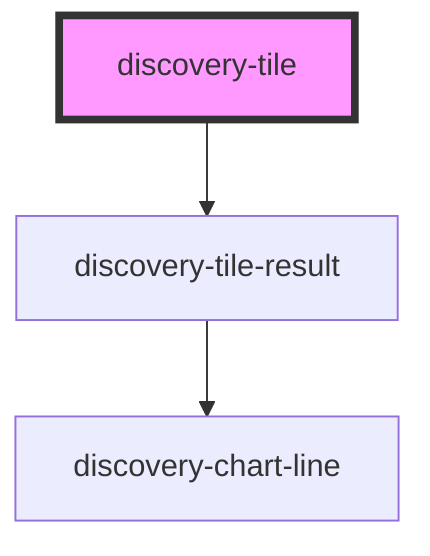

# discovery-tile

<!-- Auto Generated Below -->

## Properties

| Property   | Attribute  | Description | Type                      | Default        |
| ---------- | ---------- | ----------- | ------------------------- | -------------- |
| `debug`    | `debug`    |             | `boolean`                 | `false`        |
| `language` | `language` |             | `"flows" \| "warpscript"` | `'warpscript'` |
| `options`  | --         |             | `Param`                   | `new Param()`  |
| `type`     | `type`     |             | `"area" \| "line"`        | `undefined`    |
| `url`      | `url`      |             | `string`                  | `undefined`    |

## Events

| Event           | Description | Type                    |
| --------------- | ----------- | ----------------------- |
| `statusHeaders` |             | `CustomEvent<string[]>` |

## Dependencies

### Depends on

- [discovery-tile-result](../discovery-tile-result)

### Graph

----------------------------------------------

*Built with [StencilJS](https://stenciljs.com/)*
