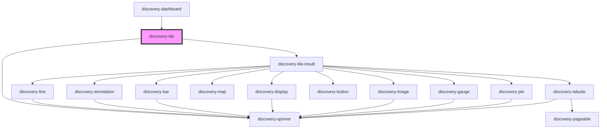

# discovery-tile

<!-- Auto Generated Below -->

## Properties

| Property      | Attribute      | Description | Type                                                                                                                                                                                                                                               | Default        |
| ------------- | -------------- | ----------- | -------------------------------------------------------------------------------------------------------------------------------------------------------------------------------------------------------------------------------------------------- | -------------- |
| `autoRefresh` | `auto-refresh` |             | `number`                                                                                                                                                                                                                                           | `-1`           |
| `chartTitle`  | `chart-title`  |             | `string`                                                                                                                                                                                                                                           | `undefined`    |
| `debug`       | `debug`        |             | `boolean`                                                                                                                                                                                                                                          | `false`        |
| `language`    | `language`     |             | `"flows" \| "warpscript"`                                                                                                                                                                                                                          | `'warpscript'` |
| `options`     | `options`      |             | `Param \| string`                                                                                                                                                                                                                                  | `new Param()`  |
| `type`        | `type`         |             | `"annotation" \| "area" \| "bar" \| "button" \| "circle" \| "display" \| "doughnut" \| "gauge" \| "image" \| "line" \| "map" \| "pie" \| "rose" \| "scatter" \| "spline" \| "spline-area" \| "step" \| "step-after" \| "step-before" \| "tabular"` | `undefined`    |
| `unit`        | `unit`         |             | `string`                                                                                                                                                                                                                                           | `''`           |
| `url`         | `url`          |             | `string`                                                                                                                                                                                                                                           | `undefined`    |

## Events

| Event           | Description | Type                    |
| --------------- | ----------- | ----------------------- |
| `statusError`   |             | `CustomEvent<any>`      |
| `statusHeaders` |             | `CustomEvent<string[]>` |

## Dependencies

### Used by

 - [discovery-dashboard](../discovery-dashboard)

### Depends on

- [discovery-tile-result](../discovery-tile-result)
- [discovery-spinner](../discovery-spinner)

### Graph

----------------------------------------------

*Built with [StencilJS](https://stenciljs.com/)*
