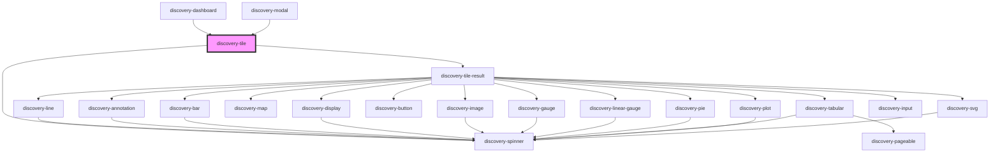

# discovery-tile

<!-- Auto Generated Below -->

## Properties

| Property      | Attribute      | Description | Type                                                                                                                                                                                                                                                                                                                                                                                                                                     | Default        |
| ------------- | -------------- | ----------- | ---------------------------------------------------------------------------------------------------------------------------------------------------------------------------------------------------------------------------------------------------------------------------------------------------------------------------------------------------------------------------------------------------------------------------------------- | -------------- |
| `autoRefresh` | `auto-refresh` |             | `number`                                                                                                                                                                                                                                                                                                                                                                                                                                 | `-1`           |
| `chartTitle`  | `chart-title`  |             | `string`                                                                                                                                                                                                                                                                                                                                                                                                                                 | `undefined`    |
| `debug`       | `debug`        |             | `boolean`                                                                                                                                                                                                                                                                                                                                                                                                                                | `false`        |
| `language`    | `language`     |             | `"flows" \| "warpscript"`                                                                                                                                                                                                                                                                                                                                                                                                                | `'warpscript'` |
| `options`     | `options`      |             | `Param \| string`                                                                                                                                                                                                                                                                                                                                                                                                                        | `new Param()`  |
| `type`        | `type`         |             | `"line" \| "area" \| "scatter" \| "step-area" \| "spline-area" \| "spline" \| "step" \| "step-after" \| "step-before" \| "annotation" \| "bar" \| "display" \| "image" \| "map" \| "gauge" \| "linear-gauge" \| "circle" \| "pie" \| "plot" \| "doughnut" \| "rose" \| "tabular" \| "svg" \| "input:text" \| "input:list" \| "input:secret" \| "input:autocomplete" \| "input:slider" \| "input:date" \| "input:date-range" \| "button"` | `undefined`    |
| `unit`        | `unit`         |             | `string`                                                                                                                                                                                                                                                                                                                                                                                                                                 | `''`           |
| `url`         | `url`          |             | `string`                                                                                                                                                                                                                                                                                                                                                                                                                                 | `undefined`    |
| `vars`        | `vars`         |             | `string`                                                                                                                                                                                                                                                                                                                                                                                                                                 | `'{}'`         |

## Events

| Event           | Description | Type                    |
| --------------- | ----------- | ----------------------- |
| `execResult`    |             | `CustomEvent<any>`      |
| `statusError`   |             | `CustomEvent<any>`      |
| `statusHeaders` |             | `CustomEvent<string[]>` |

## Methods

### `exec(refresh?: boolean) => Promise<void>`

#### Returns

Type: `Promise<void>`

### `resize() => Promise<void>`

#### Returns

Type: `Promise<void>`

### `setZoom(dataZoom: { start: number; end: number; }) => Promise<void>`

#### Returns

Type: `Promise<void>`

## Dependencies

### Used by

 - [discovery-dashboard](../discovery-dashboard)
 - [discovery-modal](../discovery-modal)

### Depends on

- [discovery-tile-result](../discovery-tile-result)
- [discovery-spinner](../discovery-spinner)

### Graph

----------------------------------------------

*Built with [StencilJS](https://stenciljs.com/)*
